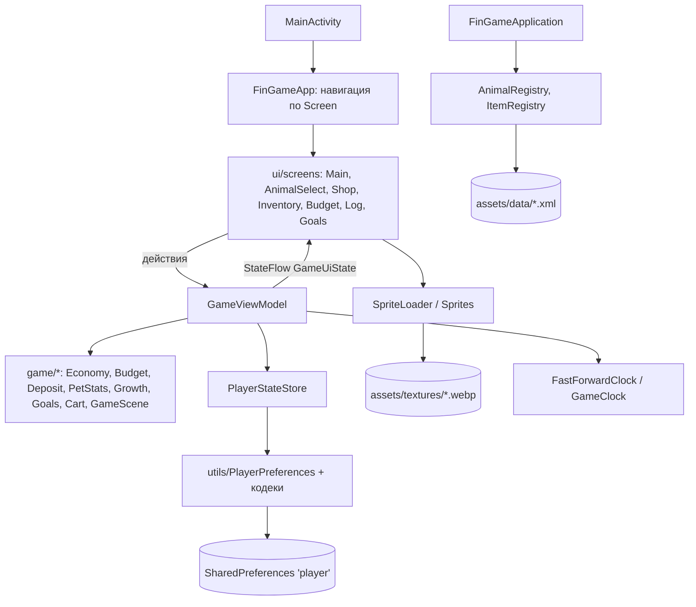

# Fin Game — сопроводительная документация

Версия документа: 1.0 от 28.09.2026. Версия приложения: 1.0 (versionCode 1).
Состояние кода: ветка `main` на коммите `7d5dd7f` плюс ветки, перечисленные в разделе 5:
PR #19 (`options`), PR #20 (`stef-quests`), PR #21 (`stef-adult`), а также готовые ветки
`stef-growth` и `stef-onboarding`, для которых PR готовится.

Условные обозначения:

- «в `main`» — функция уже в основной ветке и попадает в сборку из `main`;
- «в ветке …» — функция сделана в отдельной ветке и ждёт слияния;
- «в работе» — функция разрабатывается, описание будет дополнено;
- `TODO ревьюер` — место, которое нужно сверить с оригинальным ТЗ хакатона или дополнить сведениями,
  которых нет в коде.

Все пути к исходникам ниже даны относительно `app/src/main/java/com/legacy/fingame/`, если не указано
иное; пути к данным — относительно `app/src/main/assets/`.

---

## 1. Назначение продукта, состав репозитория, быстрый запуск

### 1.1. Назначение

Fin Game — игра для Android, которая в форме тамагочи учит ребёнка основам финансовой грамотности.
Ребёнок выбирает питомца и заботится о нём: кормит, развлекает, наряжает. Всё это стоит монет, а
монеты приходят раз в день. Чтобы питомец был сыт и доволен, а на желанную покупку хватило денег,
ребёнку приходится планировать: разделять траты на обязательные и необязательные, откладывать,
открывать вклад, ставить цели.

<!-- TODO ревьюер: сверить формулировку назначения и целевой возраст с ТЗ хакатона (в коде возраст не зафиксирован). -->

Целевая аудитория:

| Роль | Что делает в приложении |
|---|---|
| Ребёнок | Играет: уход за питомцем, покупки, бюджет, вклад, цели, квесты |
| Родитель | Во взрослом режиме (за замком) смотрит отчёты и историю, добавляет свои товары и квесты (в ветке `stef-adult`) |

Ключевые свойства:

- полностью офлайн: нет сервера, нет сетевых запросов, нет аналитики, в манифесте нет разрешения
  `INTERNET`;
- все данные хранятся локально в `SharedPreferences` приложения;
- время в игре реальное: питомец голодает и растёт и при закрытом приложении;
- демо-сборка позволяет «перемотать» время на 12 часов, чтобы показать игру за несколько минут.

### 1.2. Состав репозитория

| Путь | Содержимое |
|---|---|
| `build.gradle.kts`, `settings.gradle.kts`, `gradle.properties` | Корневая конфигурация Gradle |
| `gradle/libs.versions.toml` | Каталог версий библиотек и плагинов |
| `gradle/wrapper/` | Gradle Wrapper 9.6.0 |
| `gradle/gradle-daemon-jvm.properties` | JVM-тулчейн демона Gradle (JDK 25, скачивается автоматически) |
| `app/build.gradle.kts` | Модуль приложения: SDK, buildTypes, демо-режим, зависимости |
| `app/src/main/AndroidManifest.xml` | Манифест: одна Activity, разрешений нет |
| `app/src/main/java/com/legacy/fingame/` | Исходный код (см. раздел 3) |
| `app/src/main/assets/data/` | Игровые данные в XML: `animals.xml`, `items.xml` (+ `quests.xml`, `audio.xml` в ветках) |
| `app/src/main/assets/textures/` | Спрайты WebP: животные, интерфейс, магазин, локации, запасной спрайт ошибки |
| `app/src/main/res/` | Иконка приложения, тема, строка названия, шрифт `press_start_2p_regular.ttf` |
| `app/src/test/` | Юнит-тесты JUnit 4 (33 класса, 354 теста) |
| `app/src/androidTest/` | Инструментальные тесты Compose UI (2 класса, 6 тестов) |
| `docs/` | Эта документация (`DOCUMENTATION.md`) и её версия в Word |

### 1.3. Быстрый запуск

1. Установить JDK 17+ и Android SDK, добавить платформу из preview-канала:
   `sdkmanager --channel=3 "platform-tools" "platforms;android-37.0" "build-tools;37.0.0"`.
2. Создать `local.properties` с `sdk.dir=<путь к SDK>` (Android Studio делает это сама).
3. `./gradlew :app:installDebug` — собрать демо-сборку и установить на устройство.
4. `./gradlew :app:testDebugUnitTest` — прогнать юнит-тесты.

Подробности — в разделе 2.

---

## 2. Требования к окружению и сборка релизного APK

### 2.1. Версии инструментов

Все значения взяты из файлов проекта.

| Компонент | Версия | Где задано |
|---|---|---|
| Gradle | 9.6.0 | `gradle/wrapper/gradle-wrapper.properties` |
| Android Gradle Plugin | 9.4.0 | `gradle/libs.versions.toml` (`agp`) |
| Kotlin (плагин Compose Compiler) | 2.4.20 | `gradle/libs.versions.toml` (`kotlin`) |
| JDK для демона Gradle | 25 (скачивается через foojay-resolver) | `gradle/gradle-daemon-jvm.properties`, `settings.gradle.kts` |
| JDK для запуска `gradlew` | 17 или новее | требование AGP 9.x |
| Уровень байткода | Java 11 (`sourceCompatibility`/`targetCompatibility`) | `app/build.gradle.kts` |
| compileSdk / targetSdk | 37 (платформа `android-37.0`) | `app/build.gradle.kts` |
| minSdk | 26 (Android 8.0) | `app/build.gradle.kts` |
| Build Tools | 37.0.0 | устанавливается вместе с платформой |
| Android Studio | версия с поддержкой AGP 9.4 | <!-- TODO ревьюер: указать точную версию Android Studio, на которой собирает команда. --> |

Особенность SDK: AGP 9 адресует платформы с минорной версией, поэтому нужна именно
`platforms;android-37.0`. Она опубликована только в preview-канале sdkmanager (`--channel=3`);
пакета `platforms;android-37` в стабильном канале нет, и без него сборка падает с ошибкой
`Failed to find target with hash string 'android-37.0'`.

Первая сборка требует интернета: Gradle скачивает дистрибутив, JDK 25 для демона и зависимости.
Дальше можно собирать с флагом `--offline`.

### 2.2. Типы сборки и демо-режим

Флейворов (productFlavors) в проекте нет. Есть два типа сборки:

| Параметр | debug | release |
|---|---|---|
| `BuildConfig.DEMO_MODE` | `true` | `false` |
| Кнопка «Вперёд на 12 часов» | есть | нет |
| Минификация (R8) | нет | отключена (`optimization { enable = false }`) |
| Подпись | отладочный ключ Android SDK | не задана (`signingConfig` отсутствует), APK подписывается вручную |
| Выходной файл | `app/build/outputs/apk/debug/app-debug.apk` | `app/build/outputs/apk/release/app-release-unsigned.apk` |

Демо-режим можно переопределить для любого типа сборки без правки файлов:
`./gradlew :app:assembleRelease -Pfingame.demoMode=true` — релизная сборка с кнопкой перемотки
времени (удобно для показа жюри).

### 2.3. Пошаговая сборка релизного APK

Шаги проверены 28.09.2026 на macOS (Apple Silicon), JDK 25, build-tools 37.0.0: сборка занимает
около 40 секунд, размер неподписанного APK — около 9 МБ.

1. Клонировать репозиторий и перейти в его корень.
2. Установить компоненты SDK:

   ```bash
   sdkmanager --channel=3 "platform-tools" "platforms;android-37.0" "build-tools;37.0.0"
   ```

3. Указать SDK:

   ```bash
   echo "sdk.dir=$HOME/Library/Android/sdk" > local.properties   # путь для macOS
   ```

   Вместо файла можно задать переменную окружения `ANDROID_HOME`.

4. Собрать релиз:

   ```bash
   ./gradlew :app:assembleRelease
   # демо-вариант релиза: ./gradlew :app:assembleRelease -Pfingame.demoMode=true
   ```

   Результат: `app/build/outputs/apk/release/app-release-unsigned.apk`.

5. Создать ключ подписи (один раз; хранить вне репозитория):

   ```bash
   keytool -genkeypair -v -keystore fingame-release.jks -alias fingame \
     -keyalg RSA -keysize 2048 -validity 10000
   ```

6. Выровнять и подписать APK утилитами из build-tools:

   ```bash
   BT=$ANDROID_HOME/build-tools/37.0.0      # или $HOME/Library/Android/sdk/build-tools/37.0.0
   $BT/zipalign -p -f 4 app/build/outputs/apk/release/app-release-unsigned.apk fingame-aligned.apk
   $BT/apksigner sign --ks fingame-release.jks --ks-key-alias fingame \
     --out fingame-1.0-release.apk fingame-aligned.apk
   $BT/apksigner verify --print-certs fingame-1.0-release.apk
   ```

7. Установить на устройство: `adb install -r fingame-1.0-release.apk`.

Если на устройстве уже стоит debug-сборка, её сначала нужно удалить (`adb uninstall com.legacy.fingame`):
подписи debug и release различаются, и Android не даст обновить одну другой. При удалении прогресс
теряется.

<!-- TODO ревьюер: решить, нужен ли в репозитории signingConfig с чтением ключа из переменных окружения / keystore.properties (сейчас подпись ручная). -->

### 2.4. Тесты из командной строки

| Команда | Что делает |
|---|---|
| `./gradlew :app:testDebugUnitTest` | Юнит-тесты (JVM), отчёт: `app/build/reports/tests/testDebugUnitTest/index.html` |
| `./gradlew :app:connectedDebugAndroidTest` | Инструментальные тесты на подключённом устройстве/эмуляторе |

Если `connectedDebugAndroidTest` не может скачать зависимости тестового раннера (встречалось на
нестабильной сети), те же тесты запускаются вручную:

```bash
./gradlew :app:assembleDebug :app:assembleDebugAndroidTest
adb install -r app/build/outputs/apk/debug/app-debug.apk
adb install -r -t app/build/outputs/apk/androidTest/debug/app-debug-androidTest.apk
adb shell am instrument -w com.legacy.fingame.test/androidx.test.runner.AndroidJUnitRunner
```

---

## 3. Функциональная и компонентная архитектура

### 3.1. Общая схема

Серверной части нет. Приложение — один модуль `:app`, одна Activity, весь UI на Jetpack Compose.
Архитектура — однонаправленный поток данных (UDF) с одной `ViewModel`:

- экраны получают неизменяемое состояние `GameUiState` из `StateFlow` и отправляют действия в
  `GameViewModel`;
- `GameViewModel` применяет правила из чистых Kotlin-объектов слоя `game/*` (без зависимостей от
  Android) и сохраняет результат через интерфейс `PlayerStateStore`;
- реализация хранилища — `PlayerPreferences` поверх `SharedPreferences`;
- неизменяемые игровые данные (животные, товары, квесты) читаются из XML в `assets/data` один раз
  при старте приложения в реестры.



То же в текстовом виде:

```
 +--------------+     +------------------------------+
 | MainActivity | --> | FinGameApp (навигация Screen) |
 +--------------+     +---------------+--------------+
                                      |
               +----------------------v-----------------------+
               | ui/screens: Main, AnimalSelect, Shop,         |
               | Inventory, Budget, Log, GoalsCarousel         |
               +----------+---------------------+--------------+
            действия      |                     ^  StateFlow<GameUiState>
               +----------v---------------------+--------------+
               |              GameViewModel                    |
               +---+--------------+----------------+-----------+
                   |              |                |
      +------------v---+  +-------v--------+  +---v----------------+
      | game/* правила |  | FastForward-   |  | PlayerStateStore   |
      | Economy,Budget,|  | Clock (время)  |  | = PlayerPreferences|
      | Deposit,Stats, |  +----------------+  | -> SharedPrefs     |
      | Growth,Goals   |                      +--------------------+
      +----------------+
 FinGameApplication -> AnimalRegistry, ItemRegistry <- assets/data/*.xml
 Sprites/SpriteLoader <- assets/textures/*.webp
```

### 3.2. Компоненты

| Слой / пакет | Компонент | Ответственность |
|---|---|---|
| точка входа | `MainActivity` | Включает edge-to-edge, задаёт тему `FinGameTheme`, показывает `FinGameApp` |
| точка входа | `FinGameApplication` | Создаёт при старте `AnimalRegistry`, `ItemRegistry`, `PlayerPreferences` |
| точка входа | `DemoMode` | Флаг демо-сборки из `BuildConfig.DEMO_MODE`, шаг перемотки 12 ч |
| `game` | `GameViewModel`, `GameUiState`, `Screen` | Единое состояние игры и все действия игрока: выбор питомца, тик статов, покупки, использование предметов, бюджет, вклад, бонус дня, цели, перемотка времени |
| `game` | `PlayerState`, `PlayerStateStore` | Сохраняемый профиль и интерфейс хранилища |
| `game/economy` | `Economy` | Стартовый баланс, бонус дня, правило доступности бонуса |
| `game/economy` | `Budget`, `BudgetDraft`, `BudgetState`, `BudgetResult`, `SpendKind` | Планирование периода, план/факт, перерасход |
| `game/economy` | `Deposit` | Вклад: сроки, ставки, проценты, погашение |
| `game/economy` | `MoneyLog`, `MoneyEntry` | Журнал движений денег (до 500 записей) |
| `game/economy` | `GameClock`, `FastForwardClock` | Источник времени; защита от перевода часов назад; перемотка в демо |
| `game/economy` | `goalProgress` | Прогресс накопления на цель |
| `game/animals` | `Animal`, `AnimalReader`, `AnimalRegistry`, `AnimalSelection`, `Growth` | Каталог животных из XML, выбор, этапы роста |
| `game/items` | `Item`, `ItemReader`, `ItemRegistry`, `ItemCatalog`, `ItemCategory`, `ItemUse`, `Inventory`, `Cart`, `ShopShelf`, `ItemSprites`, `Goals` | Каталог товаров, категории и способ использования, корзина, инвентарь, цели |
| `game/stats` | `PetStats`, `StatKind` | Шкалы питомца и их убывание |
| `game/scene` | `GameScene`, `GameLayer`, `SceneViewport` | Слои сцены (фон, декор, питомец, одежда), масштаб и сдвиг сцены жестами |
| `ui` | `FinGameApp` | Корневой Composable: навигация по `Screen`, системная кнопка «Назад», периодический тик |
| `ui/screens` | `MainScreen`, `AnimalSelectScreen`, `ShopScreen`, `InventoryScreen`, `BudgetScreen`, `LogScreen`, `GoalsCarousel`, `PlaceholderScreen` | Экраны игры |
| `ui/screens` | `MoneyFormat`, `GoalFormat`, `AmountSteps`, `ShopCardSizing` | Форматирование сумм и дат, шаги ввода сумм, расчёт размеров карточек |
| `ui/components` | `GameComponents`, `GameDialog`, `Sprites`, `PillButtonSizing` | Общие пиксельные кнопки, шкалы, диалоги, доступ к спрайтам |
| `ui/theme` | `Theme`, `Color`, `Type`, `Fonts`, `Dimens` | Цвета, типографика на пиксельном шрифте, размеры для телефона и планшета |
| `utils` | `PlayerPreferences` | Сохранение и загрузка `PlayerState`, миграция старых ключей |
| `utils` | `MoneyLogCodec`, `GoalsCodec` | Сериализация журнала и целей в строку |
| `utils` | `SpriteLoader` | Загрузка WebP из `assets/textures`, подстановка `error/error.webp` при отсутствии файла |
| данные | `assets/data/*.xml` | Животные, товары (в ветках — квесты, аудио) |
| ассеты | `assets/textures/**` | Пиксельные спрайты |

Компоненты из веток (раздел 5): `game/quests/*` и `ui/screens/QuestsScreen.kt` (`stef-quests`);
`game/settings/*` (`GameSettings`, `GameSettingsRepository`, `AudioManager`, `AudioReader`),
`game/scene/PetTouch.kt`, `ui/screens/SettingsScreen.kt` (ветка `options`); `game/adult/*`
(`ParentLock`, `AdultReports`), `game/economy/BudgetHistory.kt`, `game/items/CustomItems.kt`,
`game/quests/CustomQuests.kt`, `ui/screens/Adult*.kt` (`stef-adult`); `game/rules/PetCareRules.kt`
(`PetCareTuning`, `PetCareRules`), `game/rules/PetCare.kt`, `game/rules/CarePricedCatalog.kt`,
`game/rules/PetCareTuningReader.kt`, `assets/data/care.xml` (`stef-growth`); `game/OnboardingGate.kt`,
`utils/OnboardingPreferences.kt`, `ui/components/OnboardingDialog.kt`, `game/help/*`
(`HelpEntry`, `HelpReader`, `HelpRegistry`), `ui/screens/HelpScreen.kt`, `assets/data/help.xml`
(`stef-onboarding`).

### 3.3. Функциональная схема (экраны и переходы)

| Экран (`Screen`) | Как попасть | Что делает |
|---|---|---|
| Окно знакомства (онбординг) | Первый запуск, ветка `stef-onboarding` | Модальное окно «Привет!» с тремя короткими правилами; закрывается только кнопкой «Понятно!» |
| Выбор питомца | Первый запуск (питомец не выбран) | Выбор животного и окраса, ввод имени |
| `MAIN` | После выбора; кнопка «Назад» с любого экрана | Сцена с питомцем и подлокациями, шкалы статов, баланс, бонус дня, карусель целей, кнопки разделов, в демо — «Вперёд на 12 часов» |
| `SHOP` | Кнопка магазина; нажатие на цель | Категории, карточки товаров с эффектами, выбор варианта, корзина, предупреждение о перерасходе плана, звёздочка «цель» |
| `INVENTORY` | Кнопка инвентаря | Использовать еду/игрушку, надеть/снять одежду и декор |
| `BUDGET` | Автоматически после бонуса дня; кнопка бюджета; из журнала | Итог прошлого периода «план/факт/разница», раскладка нового периода, открытие и досрочное закрытие вклада |
| `LOG` | Кнопка журнала; из бюджета | Все движения денег по дням, новейшие сверху |
| `QUESTS` | Кнопка квестов | В `main` — заглушка; в ветке `stef-quests` — доска квестов |
| `OPTIONS` | Кнопка настроек | В `main` — заглушка; в ветке `options` — звук, музыка, тема, сброс прогресса, вход во взрослый режим |
| `ADULT_LOCK`, `ADULT_MODE` | Из настроек | Только в ветке `stef-adult`: замок и хаб взрослого |
| «Помощь» (`HelpScreen`) | Из настроек, ветка `stef-onboarding` | Словарик из 11 терминов с объяснениями для ребёнка |

### 3.4. Жизненный цикл данных

1. При запуске `GameViewModel` читает `PlayerState` из `PlayerPreferences` и переносит его в
   `GameUiState`.
2. `FinGameApp` периодически вызывает `tick()`: начисляются прошедшие «тики» убывания статов,
   пересчитывается этап роста, погашается созревший вклад.
3. Каждое действие игрока порождает новое неизменяемое состояние и сразу сохраняется (`persist()`),
   поэтому закрытие приложения в любой момент не теряет прогресс.
4. Время читается через `FastForwardClock`: он не даёт игре уйти назад при переводе часов
   устройства и хранит сдвиг, накопленный перемоткой в демо-сборке.

---

## 4. Структура данных

### 4.1. Профиль игрока — `PlayerState`

Файл `game/PlayerState.kt`. Один профиль на установку.

| Поле | Тип | По умолчанию | Смысл |
|---|---|---|---|
| `selection` | `AnimalSelection?` (`animalId`, `variantId`) | `null` | Выбранный питомец; `null` — показывается экран выбора |
| `petName` | `String` | `""` | Имя питомца |
| `subLocationIndex` | `Int` | 0 | Текущая подлокация (Гостиная, Кухня, Спальня, Двор) |
| `balance` | `Int` | 200 | Текущий счёт, монеты |
| `deposit` | `Deposit?` | `null` | Открытый вклад (второй счёт) |
| `budget` | `BudgetState?` | `null` | Бюджет текущего периода |
| `previousBudgetResult` | `BudgetResult?` | `null` | Итог прошлого периода |
| `budgetDraft` | `BudgetDraft?` | `null` | Незавершённая раскладка (переживает перезапуск) |
| `planningOpen` | `Boolean` | `false` | Открыто ли окно планирования нового периода |
| `moneyLog` | `MoneyLog` | пусто | Журнал денег |
| `lastDailyBonusDay` | `Long` | `Long.MIN_VALUE` | День последнего бонуса (дни с 1970-01-01) |
| `owned` | `Map<ItemSelection, Int>` | пусто | Купленные предметы по варианту и количеству |
| `worn` | `Set<ItemSelection>` | пусто | Надетые/расставленные предметы |
| `goals` | `List<ItemSelection>` | пусто | Цели в порядке добавления |
| `stats` | `PetStats` | все шкалы 100 | Здоровье, сытость, настроение |
| `statsUpdatedAtMillis` | `Long` | не задано | Момент последнего пересчёта статов |
| `petBornAtMillis` | `Long` | не задано | Момент появления питомца (от него считается рост) |
| `gameNowMillis` | `Long` | не задано | Последний показанный игроку момент (защита от отката часов) |
| `clockShiftMillis` | `Long` | 0 | Сдвиг времени, накопленный перемоткой в демо |
| `care` (ветка `stef-growth`) | `PetCare?` (`growthMillis`, `judgedDays`, `dayBestCare`, `neglectStreak`) | `null` | Накопленный рост, число оценённых дней питомца, лучший индекс ухода за текущий день, серия дней без заботы |

### 4.2. Хранилище — `PlayerPreferences`

Файл `utils/PlayerPreferences.kt`. `SharedPreferences` с именем `player`, режим `MODE_PRIVATE`.

- Простые поля хранятся отдельными ключами: `balance`, `pet_name`, `selected_animal_id`,
  `selected_animal_variant_id`, `last_daily_bonus_day`, `stats_updated_at`, `pet_born_at`,
  `game_now`, `clock_shift`, `planning_open` и т. д.
- Шкалы питомца: по ключу на шкалу, `stat_<имя>` (`stat_health`, `stat_hunger`, `stat_pleasure`).
- Вклад: `deposit_amount`, `deposit_term_days`, `deposit_rate_percent`, `deposit_opened_day`.
- Бюджет, итог прошлого периода и черновик — группы ключей `budget_*`, `previous_budget_*`,
  `budget_draft_*` с флагом присутствия `*_present`.
- Предметы: `owned_items` и `worn_items` — множества строк вида `itemId:variantId=count` и
  `itemId:variantId`.
- Журнал (`money_log`) и цели (`goals`) сериализуются кодеками `MoneyLogCodec` и `GoalsCodec`:
  записи разделены управляющим символом U+001E, поля — U+001F, поэтому любые тексты (в том числе
  с двоеточиями и запятыми) сохраняются без экранирования. Повреждённые записи пропускаются с
  сообщением в logcat, остальные читаются.
- Миграция: ключи прежних версий (`savings` и старая форма бюджета) перечислены в
  `RETIRED_KEYS`; сумма со старого счёта «сбережения» при загрузке возвращается на баланс, а сами
  ключи удаляются при следующем сохранении. Тест `PlayerPreferencesKeysTest` следит, чтобы
  действующие и выведенные ключи не пересекались.

В ветках добавляются ключи: `quests`, `quests_seen_at`, `last_random_quest_at` (квесты);
`budget_history`, `quest_log`, `custom_items`, `custom_quests` (взрослый режим); `care_growth_millis`,
`care_judged_days`, `care_day_best`, `care_neglect_streak` (правила ухода, `stef-growth`; старый сейв
без этих ключей мигрирует через `PetCare.migrated`: прожитые сутки засчитываются как рост, серия
начинается с нуля); `onboarding_seen` (окно знакомства показано, `stef-onboarding`). Настройки
(ветка `options`) хранятся отдельно — `SharedPreferences` `fin_game_settings`: `sound_enabled`,
`music_enabled`, `theme_mode`.

### 4.3. Игровая экономика

**Два счёта.** Текущий счёт (`balance`) и вклад (`deposit`). Отдельного счёта «сбережения» нет:
сбережения — это часть текущего счёта, которую ребёнок запланировал не тратить.

**Бюджет периода.** Период длится от одного бонуса дня до следующего.

| Структура | Поля | Назначение |
|---|---|---|
| `BudgetDraft` | `mustSpend`, `wantSpend`, `depositAmount`, `depositTermDays` | Раскладка, которую ребёнок двигает ползунками |
| `BudgetState` | `plannedMust`, `plannedWant`, `plannedSavings`, `plannedDeposit`, `spentMust`, `spentWant`, `startDay` | Подтверждённый план и факт трат текущего периода |
| `BudgetResult` | план и факт по обязательным, необязательным, сбережениям; `plannedDeposit` | Итог прошлого периода для отчёта «план — факт — разница» |
| `SpendKind` | `MUST` «Обязательные», `WANT` «Необязательные» | Вид траты |

Категории товаров и вид траты (`game/items/ItemCategory.kt`):

| Категория | `xmlName` | Использование | Вид траты | Слой сцены |
|---|---|---|---|---|
| Еда | `food` | расходуется (`CONSUMED`) | обязательные | — |
| Игрушки | `toys` | многоразовые (`REUSABLE`) | обязательные | — |
| Одежда | `clothes` | надевается (`WEARABLE`) | необязательные | `CLOTHES` |
| Декор | `decor` | ставится в комнату (`WEARABLE`) | необязательные | `ENVIRONMENT_BACK` |

**Вклад** — `Deposit(amount, termDays, ratePercent, openedDay)`; правила в разделе 6.4.

**Журнал** — `MoneyEntry(reason, delta, gameDay, timestampMillis)`, новейшие сверху, не более 500
записей. Причины: «Бонус дня», «Награда», «Вклад открыт», «Вклад закрыт», «Проценты по вкладу»,
«Вклад закрыт досрочно», покупка «<товар> xN» (в ветке квестов — ещё строка с названием квеста).

**Цели** — список `ItemSelection` (товар + вариант). Купленная цель снимается автоматически.

### 4.4. Каталоги в XML

`assets/data/animals.xml`:

```xml
<animal id="cat" name="Кот" ages="3">
    <variants path="animals/cat/">
        <variant id="orange" />
        <variant id="white" />
    </variants>
</animal>
```

| Животное | id | Окрасы | Этапов роста | Спрайты |
|---|---|---|---|---|
| Кот | `cat` | `orange`, `white` | 3 (0, 1, 2) | `textures/animals/cat/<окрас>/<этап>/idle.webp` |
| Рыба | `fish` | `golden` | 3 | `textures/animals/fish/golden/<этап>/idle.webp` |

`assets/data/items.xml` — товары: `id`, `name`, `price`, `category`, список `<variant>` и список
`<effect stat="health|hunger|pleasure" value="±N">`.

| Товар | id | Цена | Категория | Варианты | Эффекты |
|---|---|---|---|---|---|
| Яблоко | `apple` | 15 | еда | default | сытость +20, здоровье +5 |
| Рыбка | `fish` | 25 | еда | default | сытость +35, настроение +5 |
| Пирожное | `cake` | 40 | еда | default | сытость +30, настроение +15, здоровье −5 |
| Мячик | `ball` | 60 | игрушки | red, blue | настроение +20, сытость −5 |
| Мишка | `teddy` | 120 | игрушки | default | настроение +30 |
| Шляпа | `hat` | 100 | одежда | black, white, violet | — |
| Шарф | `scarf` | 80 | одежда | red, green | — |
| Лампа | `lamp` | 150 | декор | default | — |
| Коврик | `rug` | 90 | декор | beige, blue | — |

Читатели (`AnimalReader`, `ItemReader`) пропускают некорректные записи с сообщением в logcat, а не
роняют игру; если не прочиталось ни одного животного, показывается понятный экран ошибки.

`assets/data/quests.xml` (ветка `stef-quests`):

```xml
<quest id kind="player|random" title progress="true|false" min-balance="N" start="<узел>">
    <description>…</description>
    <node id delay-minutes="N">
        <text>Ситуация</text>
        <option label="Кнопка" next="<узел>|end" money="±N" progress="±N">
            <result>Что случилось</result>
            <effect stat="health|hunger|pleasure" value="±N" />
        </option>
    </node>
</quest>
```

Состояние квеста — `QuestProgress` (`questId`, `nodeId`, `status`, `progress` 0–100,
`availableAtMillis`, `lastChoice`), сериализуется `QuestStateCodec`.

`assets/data/audio.xml` (ветка `options`): список фоновых треков `<background><track file=…/>`
относительно `assets/audio/`; звуки питомца лежат в `assets/audio/sounds/animal/`.

`assets/data/care.xml` (ветка `stef-growth`): один элемент `<care …/>` с параметрами правил ухода
(значения — в разделе 6.3). Атрибут, которого нет или который не читается, берётся по умолчанию из
`PetCareTuning`.

`assets/data/help.xml` (ветка `stef-onboarding`): словарик для раздела «Помощь»,
`<term id="…" title="…" text="…"/>`, 11 терминов (тексты — в разделе 7.2).

### 4.5. История для взрослого (ветка `stef-adult`)

| Структура | Содержимое |
|---|---|
| `BudgetHistory` | Итоги периодов `BudgetResult`, до 60 последних (около двух месяцев) |
| `DayReport` | По игровому дню: план, факт обязательных и необязательных трат, доход, покупки |
| `QuestHistoryEntry` | Квест и все выборы ребёнка в нём |
| `CustomItems` | Товары, добавленные родителем: до 50 шт., имя до 20 символов, цена 1–999, эффекты −50…+50 с шагом 5 |
| `CustomQuests` | Квесты родителя: до 20 шт., 1–3 шага, 2–3 варианта, деньги −100…+100 с шагом 10, настроение −20…+20 |

<!-- TODO ревьюер: после слияния stef-adult сверить таблицу 4.5 с итоговым кодом. -->

---

## 5. Матрица соответствия функциональным требованиям

Матрица составлена по фактической функциональности приложения. Колонка «Требование» сформулирована
командой; её нужно сопоставить с пунктами ТЗ.

<!-- TODO ревьюер: сопоставить каждую строку с номером пункта обязательных требований ТЗ хакатона и добавить строки для требований, которые здесь не отражены. -->

Статусы: **готово** — в `main`; **в ветке** — сделано, ждёт слияния; **в работе** — разрабатывается.

| № | Требование | Статус | Экран / модуль | Тесты |
|---|---|---|---|---|
| 1 | Выбор питомца (вид, окрас, имя) | готово | `ui/screens/AnimalSelectScreen.kt`, `game/animals/*`, `animals.xml` | `AnimalReaderTest`, `AnimalRegistryTest`, `AnimalSelectionSaverTest` |
| 2 | Уход за питомцем: шкалы здоровья, сытости, настроения, убывание со временем | готово | `MainScreen`, `game/stats/PetStats.kt`, `StatKind.kt` | `PetStatsTest`, `PetCareTest` |
| 3 | Применение предметов к питомцу (эффекты на шкалы) | готово | `InventoryScreen`, `GameViewModel.useItem` | `ItemEffectsTest`, `PetCareTest` |
| 4 | Рост питомца по этапам | готово (в `main` — этап в сутки; с учётом ухода — ветка `stef-growth`) | `game/animals/Growth.kt` | `GameViewModelTest`, `FastForwardTest` |
| 5 | Правила роста, зависящие от ухода, и штрафы (меньше бонус дня, дороже необязательное), подсказка ребёнку | готово, ветка `stef-growth`, PR готовится | `game/rules/PetCareRules.kt`, `PetCare.kt`, `CarePricedCatalog.kt`, `PetCareTuningReader.kt`, `care.xml`; подсказка на главном экране и в карточке «Новый день» бюджета | `PetCareRulesTest`, `PetCareProgressTest`, `GameCareRulesTest`, `PetCareTuningReaderTest` |
| 6 | Доход: ежедневный бонус | готово | `MainScreen`, `game/economy/Economy.kt` | `EconomyTest` |
| 7 | Магазин: категории, корзина, варианты, проверка баланса | готово | `ShopScreen`, `game/items/Cart.kt`, `ShopShelf.kt` | `EconomyTest`, `ShopCardSizingTest`, `ItemReaderTest`, `ItemSpritesTest` |
| 8 | Инвентарь: расходуемые, многоразовые, надеваемые предметы | готово | `InventoryScreen`, `game/items/Inventory.kt` | `PetCareTest`, `GameSceneTest` |
| 9 | Бюджет периода: обязательные / необязательные / сбережения, отчёт «план — факт» | готово | `BudgetScreen`, `game/economy/Budget.kt` | `BudgetTest`, `BudgetFlowTest`, `SpendKindTest`, `AmountStepsTest` |
| 10 | Предупреждение о выходе за план при покупке | готово | `ShopScreen` (`Budget.overspendsOf`) | `BudgetTest`, `BudgetFlowTest` |
| 11 | Вклад с процентами, досрочное закрытие без процентов | готово | `BudgetScreen`, `game/economy/Deposit.kt` | `DepositTest`, `BudgetFlowTest` |
| 12 | Цели накопления и прогресс | готово (PR #22) | `GoalsCarousel`, `ShopScreen`, `game/items/Goals.kt` | `GoalsTest`, `GoalsCodecTest`, `GameViewModelGoalsTest`, `GoalFormatTest` |
| 13 | Журнал операций с деньгами | готово | `LogScreen`, `game/economy/MoneyLog.kt` | `MoneyLogTest`, `MoneyLogCodecTest`, `MoneyFormatTest` |
| 14 | Квесты: ситуации выбора с последствиями для денег и питомца, случайные события | в ветке `stef-quests`, PR #20 | `QuestsScreen`, `game/quests/*`, `quests.xml` | `QuestEngineTest`, `QuestReaderTest`, `QuestBoardTest`, `QuestFormatTest`, `QuestStateCodecTest`, `ShippedQuestsTest`, `GameViewModelQuestTest` |
| 15 | Взрослый режим: замок от ребёнка | в ветке `stef-adult`, PR #21 | `AdultLockScreen`, `game/adult/ParentLock.kt` | `ParentLockTest`, `GameViewModelAdultModeTest` |
| 16 | Взрослый режим: отчёты по дням, покупкам, квестам, история бюджета | в ветке `stef-adult`, PR #21 | `AdultScreen`, `game/adult/AdultReports.kt`, `BudgetHistory.kt` | `AdultReportsTest`, `AdultFormatTest`, `BudgetHistoryCodecTest`, `GameViewModelAdultDataTest` |
| 17 | Взрослый режим: свои товары и квесты родителя | в ветке `stef-adult`, PR #21 | `AdultItemsTab`, `AdultQuestsTab`, `CustomItems.kt`, `CustomQuests.kt` | `CustomItemsTest`, `CustomQuestsTest`, `GameViewModelCustomItemsTest`, `GameViewModelCustomQuestsTest` |
| 18 | Настройки: звуки, музыка, тема (светлая/тёмная/авто) | в ветке `options`, PR #19 | `SettingsScreen`, `game/settings/*` | `AudioReaderTest` |
| 19 | Сброс прогресса | в ветке `options`, PR #19 | `SettingsScreen`, `GameViewModel.resetProgress` | `GameViewModelTest` (в ветке) |
| 20 | Взаимодействие с питомцем касанием (сердечки, звук) | в ветке `options`, PR #19 | `game/scene/PetTouch.kt` | `HeartBurstTest`, `PetTouchAssetsTest` |
| 21 | Онбординг: окно знакомства при первом запуске | готово, ветка `stef-onboarding`, PR готовится | `game/OnboardingGate.kt`, `utils/OnboardingPreferences.kt`, `ui/components/OnboardingDialog.kt` | `OnboardingGateTest` |
| 21а | Раздел «Помощь»: словарик финансовых терминов | готово, ветка `stef-onboarding`, PR готовится | `ui/screens/HelpScreen.kt`, `game/help/*`, `help.xml` | `HelpReaderTest` |
| 22 | Сохранение прогресса между запусками, в том числе при закрытом приложении | готово | `utils/PlayerPreferences.kt` | `RestartTest`, `PlayerPreferencesKeysTest` |
| 23 | Защита от перевода часов устройства | готово | `FastForwardClock`, `Economy.isDailyBonusAvailable`, `PetStats.ticksBetween` | `FastForwardTest`, `EconomyTest`, `PetStatsTest` |
| 24 | Демо-режим для показа (перемотка времени) | готово | `DemoMode.kt`, `MainScreen` | `FastForwardTest` |
| 25 | Адаптивность: узкий телефон, крупный шрифт, альбом, планшет | готово | `ui/theme/Dimens.kt`, `MainScreen`, `ShopCardSizing` | `MainScreenLayoutTest`, `ShopCardSizingTest`, `PillButtonSizingTest`, `BudgetLabelSizeTest` |
| 26 | Масштаб и перемещение сцены жестами | готово | `game/scene/SceneViewport.kt` | `SceneViewportTest`, `SceneGesturesTest` (инструментальный) |
| 27 | Работа без сети, локальное хранение данных | готово | `AndroidManifest.xml` | проверка манифеста (раздел 9) |

Слияния в `main`: PR #18 (экономика, бюджет, вклад, рост, выбор питомца, демо-режим), PR #22 (цели),
PR #23 (сообщения об ошибках чтения данных). Открыты: PR #19 `options` (музыка, звуки, настройки,
вход во взрослый режим), PR #20 `stef-quests` (система квестов), PR #21 `stef-adult` (взрослый режим).
Ветки `stef-growth` и `stef-onboarding` готовы, PR готовится.

---

## 6. Формулы и правила расчёта

Все константы взяты из кода; при изменении кода таблицы нужно обновить.

### 6.1. Шкалы питомца

- Три шкалы: здоровье (`health`), сытость (`hunger`), настроение (`pleasure`). Диапазон 0–100,
  100 — хорошо. Новый питомец начинает со 100 по всем шкалам.
- Тик — 5 минут реального времени (`PetStats.TICK_MILLIS`). Шкалы убывают и при закрытом
  приложении: при следующем запуске применяются все целые тики, прошедшие с прошлого пересчёта.

| Шкала | Убыль за тик | Убыль в час | От 100 до 0 |
|---|---|---|---|
| Сытость | 3 | 36 | 34 тика ≈ 2 ч 50 мин |
| Настроение | 2 | 24 | 50 тиков ≈ 4 ч 10 мин |
| Здоровье | 1 | 12 | 100 тиков ≈ 8 ч 20 мин |

Формулы:

```
тики = floor((сейчас − statsUpdatedAt) / 5 мин),   0 если сейчас < statsUpdatedAt
шкала' = clamp(шкала − decayPerTick × тики, 0, 100)
statsUpdatedAt' = statsUpdatedAt + тики × 5 мин        (остаток времени не теряется)
использование предмета: шкала' = clamp(шкала + эффект, 0, 100) по каждому эффекту
```

Еда при использовании исчезает из инвентаря (−1 шт.), игрушка остаётся. Одежда и декор не
применяются к шкалам, а надеваются/снимаются.

### 6.2. Рост питомца

```
этап = 0,                                  если питомец не выбран или часы ушли назад
этап = floor((сейчас − petBornAt) / 24 ч)  иначе
отображаемый этап = min(этап, ages − 1)    (у кота и рыбы 3 этапа: 0, 1, 2)
```

Этап не хранится, а вычисляется из момента появления питомца, поэтому рост идёт и при закрытом
приложении. Это правило действует в `main`; в ветке `stef-growth` рост зависит от ухода (раздел 6.3),
и `Growth.ageAt` заменён на `Growth.ageOf(growthMillis)`.

### 6.3. Правила роста, зависящие от ухода, и штрафы (ветка `stef-growth`)

Код: `game/rules/PetCareRules.kt` (`PetCareTuning`, `PetCareRules`), `game/rules/PetCare.kt`,
`game/rules/CarePricedCatalog.kt`, `game/rules/PetCareTuningReader.kt`; параметры —
`assets/data/care.xml`. Тесты: `PetCareRulesTest` (11), `PetCareProgressTest` (8),
`GameCareRulesTest` (14), `PetCareTuningReaderTest` (4).

**Индекс ухода** — среднее всех шкал, от 0,0 до 1,0:

```
индекс = (здоровье + сытость + настроение) / (3 × 100)
```

Берётся среднее, а не минимум: здоровье почти нечем поднять в магазине, и минимум наказывал бы
ребёнка за то, на что он не может повлиять.

**День питомца** — сутки от момента, когда питомца взяли (`Growth.STAGE_MILLIS` = 24 ч), а не
календарный день. День оценивается по лучшему индексу, который был за этот день (`dayBestCare`).
Если приложение было закрыто несколько дней, каждый следующий день начинается со шкал, до которых
питомец успел опустеть к его началу.

**Рост:**

```
множитель роста = 0,0   если индекс дня < stopGrowthBelow (0,25)   — рост стоит
                = 0,5   если индекс дня < slowGrowthBelow (0,5)    — растёт вдвое медленнее
                = 1,0   иначе
за каждый закрытый день: growthMillis += 24 ч × множитель роста
этап = floor(growthMillis / 24 ч)          (Growth.ageOf(growthMillis))
```

**Серия дней без заботы** (`neglectStreak`): день с индексом < `neglectBelow` (0,5) увеличивает
серию на 1, любой другой день обнуляет её. Потолок — 365 дней.

**Штраф к бонусу дня:**

```
множитель дохода = 1 − min(10 % × серия, 40 %)
бонус дня = round(50 × множитель дохода)     (половина округляется вверх)
```

| Серия, дней | 0 | 1 | 2 | 3 | 4 и больше |
|---|---|---|---|---|---|
| Бонус дня, монет | 50 | 45 | 40 | 35 | 30 |

Кнопка «Бонус дня +N» и запись в журнале показывают фактическую сумму.

**Наценка на необязательное:**

```
множитель цены = 1 + min(10 % × серия, 50 %)      только для одежды и декора (WANT)
цена = round(базовая цена × множитель цены)       (половина округляется вверх)
еда и игрушки (MUST) не дорожают
```

Пример: шляпа за 100 монет при серии 2 дня стоит 120, при серии 5 дней и дольше — 150. Цены
пересчитывает обёртка каталога `CarePricedCatalog` (`vm.shopCatalog`): её используют карточки
магазина, корзина, цели, `priceOf` и `buyCart`.

**Подсказка ребёнку** — `PetCareRules.explain(stats, dayBestCare, neglectStreak)`, показывается под
питомцем на главном экране (`CareHint`) и в карточке «Новый день» на экране бюджета. Слабейшая шкала
называется словами: «голодный», «скучает», «приболел».

| Ситуация | Текст |
|---|---|
| Рост замедлен | «Питомец голодный — он растёт медленнее.» |
| Рост остановлен | «Питомец скучает и перестал расти. Позаботься о нём!» |
| Серия дней без заботы | «Питомец 2 дня без заботы — бонус дня меньше, а наряды и декор дороже.» |
| Хороший уход | подсказки нет |

**Параметры `care.xml`:**

| Параметр | Значение | Смысл |
|---|---|---|
| `stopGrowthBelow` | 0.25 | Ниже — рост за день не начисляется |
| `slowGrowthBelow` | 0.5 | Ниже — рост замедлен |
| `slowGrowthMultiplier` | 0.5 | Множитель замедленного роста |
| `neglectBelow` | 0.5 | Ниже — день без заботы |
| `incomePenaltyPercentPerDay` | 10 | Штраф к бонусу дня за каждый день серии, % |
| `maxIncomePenaltyPercent` | 40 | Предел штрафа к бонусу, % |
| `optionalMarkupPercentPerDay` | 10 | Наценка на необязательное за день серии, % |
| `maxOptionalMarkupPercent` | 50 | Предел наценки, % |

**Сохранение:** `PlayerState.care: PetCare?`, ключи `care_growth_millis`, `care_judged_days`,
`care_day_best`, `care_neglect_streak`. Сейв прежней версии мигрирует через `PetCare.migrated`:
прожитые сутки засчитываются как полный рост, серия начинается с нуля.

### 6.4. Деньги

| Параметр | Значение | Где |
|---|---|---|
| Стартовый баланс | 200 монет | `Economy.STARTING_BALANCE` |
| Бонус дня | 50 монет, один раз в календарные сутки (в ветке `stef-growth` уменьшается при серии дней без заботы, раздел 6.3) | `Economy.DAILY_BONUS` |
| Доступность бонуса | `сегодня > день последнего бонуса` (перевод часов назад бонус не даёт) | `Economy.isDailyBonusAvailable` |
| Максимум одного товара в корзине | 99 шт. еды; одежда, декор и игрушки — 1 шт. каждого варианта, если его ещё нет | `GameViewModel.maxQuantityOf` |
| Демо-перемотка | +12 часов за нажатие | `DemoMode.FAST_FORWARD_HOURS` |

**Покупка:**

```
стоимость корзины = Σ цена(товар) × количество
покупка возможна, если стоимость ≤ balance
balance' = balance − стоимость
spentMust' = spentMust + Σ стоимость товаров категорий «еда», «игрушки»
spentWant' = spentWant + Σ стоимость товаров категорий «одежда», «декор»
перерасход(вид) = max(0, spent(вид) + корзина(вид) − planned(вид))   → предупреждение, не запрет
```

**Бюджет.** Бонус дня закрывает текущий период и открывает планирование следующего.

```
Итог закрываемого периода (BudgetResult):
  actualMust = spentMust, actualWant = spentWant
  actualSavings = balance до начисления бонуса
  разница: must = planned − actual; want = planned − actual; savings = actual − planned
  (плюс — уложились / сберегли больше, минус — вышли за план)

Раскладка нового периода (Budget.normalize), всего = balance после бонуса:
  deposit = clamp(депозит, 0, всего)          — только если вклад сейчас не открыт
  must    = clamp(обязательные, 0, всего − deposit)
  want    = clamp(необязательные, 0, всего − deposit − must)
  plannedSavings = всего − must − want − deposit
После подтверждения: balance' = всего − deposit; план изменить нельзя до следующего бонуса.
```

**Вклад** (`Deposit`):

| Срок, дней | 2 | 3 | 4 | 5 | 6 | 7 |
|---|---|---|---|---|---|---|
| Ставка за срок, % | 4 | 6 | 8 | 10 | 12 | 15 |

```
проценты = round(сумма × ставка / 100)          (округление до целой монеты)
день погашения = день открытия + срок
в день погашения и позже: balance' = balance + сумма + проценты  (две строки в журнале)
досрочное закрытие: balance' = balance + сумма  (проценты не начисляются)
открыть вклад можно только при планировании периода и только если другой вклад не открыт
```

Пример: 100 монет на 7 дней → проценты 15, к возврату 115 монет.

**Прогресс цели:**

```
прогресс = 1, если цена ≤ 0 или balance ≥ цена
прогресс = 0, если balance ≤ 0
иначе прогресс = balance / цена
```

### 6.5. Квесты (ветка `stef-quests`)

| Правило | Значение |
|---|---|
| Начать квест | `balance ≥ min-balance` и квест ещё не идёт; `min-balance` не списывается |
| Вариант с тратой | доступен, только если хватает денег: `−money ≤ balance` |
| Изменение денег | `balance' = max(0, balance + money)`, строка в журнале с названием квеста |
| Изменение шкал | `шкала' = clamp(шкала + effect, 0, 100)` |
| Шкала квеста (если `progress="true"`) | `progress' = clamp(progress + Δ, 0, 100)` |
| Пауза между шагами | `delay-minutes` игрового времени |
| Случайный квест | не чаще раза в 6 ч; при проверке выпадает с вероятностью 1/4; одновременно не больше одного случайного |

Награды квестов из `quests.xml`:

| Квест | Тип | Деньги по вариантам | Главные эффекты |
|---|---|---|---|
| Пикник | по выбору, от 100 монет | фрукты −40 / чипсы −15 / ничего 0; бадминтон −20 | сытость, здоровье, настроение; шкала подготовки |
| Копилка | по выбору | сразу потратить 0; открыть копилку +20; копить дальше +40 | настроение |
| Потерянный кошелёк | случайный | вернуть +20; оставить +30 | вернуть: настроение +15; оставить: настроение −20 |
| Гости | случайный | испечь −10 / купить торт −30 / чай 0 | шкала подготовки, настроение, здоровье |

<!-- TODO ревьюер: баланс наград и цен не откалиброван, значения — рабочие; подтвердить или прислать целевые. -->

---

## 7. Карта образовательного контента

| Тема | Ожидаемый навык | Сценарий в игре | Правильная логика | Объяснение для ребёнка |
|---|---|---|---|---|
| Доход | Понимать, что деньги приходят регулярно и в ограниченном объёме | Бонус дня +50 монет раз в сутки | Деньги не бесконечны: следующая порция будет только завтра | «Монетки приходят раз в день. Распредели их так, чтобы хватило до следующего раза» |
| Обязательные и необязательные траты | Отличать нужное от желаемого | Еда и игрушки — «Обязательные», одежда и декор — «Необязательные» | Сначала закрыть нужды питомца (сытость, настроение), потом тратить на украшения | «Сначала покорми питомца и поиграй с ним, а шляпу можно купить, когда останутся монетки» |
| Планирование бюджета | Составлять план расходов до покупок | После бонуса открывается раскладка: обязательные / необязательные / сбережения / вклад | План подтверждается один раз на период; перерасход виден при покупке | «Реши заранее, сколько потратить на еду и сколько на подарки. После подтверждения план не изменить» |
| Контроль исполнения плана | Сравнивать план и факт | Итог периода «план — факт — разница», предупреждение «+N сверх плана» в корзине | Плюс — уложились, минус — вышли за план | «Плюс — ты не потратил всё, минус — вышел за план» |
| Сбережения | Откладывать часть денег | Остаток после раскладки — «сбережения», факт сверяется в итоге | Отложенное остаётся на счёте и копится | «Останется то, что ты решил сохранить» |
| Вклад и проценты | Понимать, что деньги на вкладе приносят доход, если их не трогать | Вклад на 2–7 дней под 4–15 %, досрочное закрытие | Чем дольше срок, тем выше ставка; досрочно — без процентов | «Положи монетки на вклад — через несколько дней они вернутся с прибавкой. Заберёшь раньше — прибавки не будет» |
| Цели накопления | Ставить финансовую цель и отслеживать прогресс | Звёздочка на товаре в магазине, карусель целей с прогрессом | Копить до полной суммы, не тратя на импульсивные покупки | «Отметь звёздочкой то, о чём мечтаешь, — полоска покажет, сколько осталось накопить» |
| Нехватка денег | Принимать ограничение | Кнопка покупки недоступна, «Не хватает монет», «Ещё нужно N» | Нельзя купить больше, чем есть; нужно подождать или копить | «Монет пока не хватает — подожди бонуса или отложи» |
| Учёт расходов | Вести учёт | Журнал: все поступления и траты по дням | Любое движение денег записывается | «Здесь видно, куда ушли и откуда пришли монетки» |
| Ответственность за питомца | Связь денег и заботы | Шкалы убывают со временем, еда восстанавливает | Регулярные обязательные траты нельзя пропускать | «Питомец проголодается, даже когда ты не играешь. Купи ему еду заранее» |
| Последствия экономии на нужном (ветка `stef-growth`) | Понимать, что отказ от обязательных трат обходится дороже | Без заботы питомец растёт медленнее или перестаёт расти; серия дней без заботы уменьшает бонус дня и повышает цены на одежду и декор | Сначала обязательное: сэкономленное на еде «съедают» штрафы | «Питомец голодный — он растёт медленнее.»; «Питомец 2 дня без заботы — бонус дня меньше, а наряды и декор дороже.» |
| Первое знакомство (ветка `stef-onboarding`) | Понять правила игры до первой покупки | Окно «Привет!» при первом запуске: три карточки | Заботиться о питомце; сначала нужное; остальное — копить | См. тексты в 7.1 |
| Качество и цена (квест «Пикник») | Сравнивать цену и пользу | Фрукты −40 (польза) против чипсов −15 (мало пользы) | Дешевле не всегда лучше, но и тратить надо с умом | «Вкусно и полезно» / «Дёшево и хрустит, но пользы мало» |
| Отложенное вознаграждение (квест «Копилка») | Терпение, накопление | Потратить подарок на мороженое или положить в копилку и подождать | Кто подождал, получает больше: +20 или +40 | «Отложенное не пропало!» |
| Честность (квест «Потерянный кошелёк») | Этичное обращение с чужими деньгами | Вернуть кошелёк (+20 и радость) или оставить (+30 и грусть) | Чужое нужно вернуть; честность вознаграждается | «Хозяин сказал спасибо… На душе светло!» |
| Бюджет мероприятия (квест «Гости») | Экономить без потери качества | Испечь пирог −10, купить торт −30 или позвать на чай бесплатно | Самому часто дешевле; подготовка важнее трат | «Скромно, зато тепло и бесплатно» |

Квесты находятся в ветке `stef-quests` (PR #20), правила ухода — в `stef-growth`, окно знакомства и
«Помощь» — в `stef-onboarding`; остальные темы доступны в `main`.

<!-- TODO ревьюер: сверить список тем с образовательными требованиями ТЗ (возрастные группы, обязательные темы). -->

### 7.1. Окно знакомства при первом запуске (ветка `stef-onboarding`)

Заголовок — «Привет!». Окно закрывается только кнопкой «Понятно!», прокручивается в альбомной
ориентации и при крупном шрифте.

| Карточка | Заголовок | Текст для ребёнка |
|---|---|---|
| 🐾 | Твой питомец | Корми его, играй с ним и заботься о нём — тогда он будет расти большим и весёлым! |
| 🍎 | Нужное | Еда и игрушки — то, без чего питомцу не обойтись. Их покупай в первую очередь. |
| ⭐ | Можно и накопить | Одежду и украшения бери, когда захочется. А монеты можно откладывать: копить на цель или положить на вклад — банк потом добавит ещё немного сверху! |

### 7.2. Раздел «Помощь»: словарик терминов (ветка `stef-onboarding`)

Открывается из настроек. Тексты берутся из `assets/data/help.xml`.

| Термин | Объяснение для ребёнка |
|---|---|
| Бюджет | План на период: сколько потратишь на нужное, сколько на приятное и сколько отложишь. |
| Бонус дня | Монеты, которые ты получаешь каждый день просто за то, что зашёл в игру, — это твой доход. |
| Обязательные траты | Еда и игрушки — то, без чего питомцу не обойтись. Их покупают в первую очередь. |
| Необязательные траты | Одежда и украшения для питомца. Это не обязательно, но приятно. |
| Сбережения | Монеты, которые ты не потратил и не положил на вклад. Они остаются с тобой на будущее. |
| Вклад | Монеты, которые ты кладёшь в банк на время. Банк платит за это процент — вернёшь больше, чем положил. |
| Цель | Вещь, на которую ты копишь. Отметь её звёздочкой в магазине — и увидишь, сколько уже накопил. |
| Журнал | Список всех твоих трат и доходов: что купил, что получил и когда. |
| Магазин | Место, где покупают еду, игрушки, одежду и украшения для питомца. |
| Инвентарь | Все вещи, которые ты купил для питомца. Отсюда их можно надеть или использовать. |
| Квесты | Маленькие задания, за которые можно получить награду. |

---

## 8. UX/UI-решения и доступность

### 8.1. Обоснование решений

| Решение | Почему |
|---|---|
| Питомец как центр игры | Забота о живом существе даёт ребёнку понятную мотивацию тратить разумно: обязательные траты — это еда питомца |
| Пиксельная графика и пиксельный шрифт | Узнаваемый игровой стиль, простые крупные формы; спрайты масштабируются целыми шагами без размытия |
| Реальное время | Приучает к регулярности: доход раз в день, питомец ждёт заботы; для показа есть демо-перемотка |
| Бюджет открывается сам после бонуса | Планирование встроено в цикл игры: получил деньги — распредели |
| Ввод сумм без клавиатуры | Ползунок и кнопки ± с круглым шагом (около 1/10 суммы: 1, 5, 10, 25, 50…) — ребёнку не нужно набирать числа |
| Предупреждение о перерасходе вместо запрета | Ребёнок сам принимает решение и видит его последствия в итоге периода |
| Короткие тексты на «ты», без терминов | Формулировки вроде «Проценты сгорят», «Плюс — не потратили всё» понятны без взрослого |
| Цели через звёздочку в магазине | Цель ставится там, где возникает желание, и сразу видна на главном экране |
| Окно знакомства — три карточки и одна кнопка (ветка `stef-onboarding`) | Ребёнок узнаёт главное правило до первой покупки; закрыть окно случайно нельзя — только кнопкой «Понятно!» |
| Словарик «Помощь» в настройках (ветка `stef-onboarding`) | Термины объяснены детским языком и доступны в любой момент, не мешая игре |
| Штрафы за плохой уход объясняются словами (ветка `stef-growth`) | Ребёнок видит причину («голодный», «скучает») и что исправить, а не только результат |
| Ошибки данных не роняют игру | Некорректные записи XML и сохранения пропускаются; отсутствующий спрайт заменяется заметной заглушкой |

### 8.2. Доступность и адаптивность

| Мера | Состояние | Где |
|---|---|---|
| Описания для TalkBack (`contentDescription`) у кнопок-картинок, шкал, карусели целей | есть, 57 мест в 10 файлах | `ui/screens/*`, `ui/components/*` |
| Озвучка счётчика карусели целей словами («1 из 3» вместо «1/3») | есть | `GoalsCarousel.kt` |
| Минимальная зона нажатия | не меньше 40 dp на главном экране; строки журнала 48 dp | `MainScreen.kt`, `LogScreen.kt` |
| Крупные кнопки на планшете | размер кнопок ×1,3 при ширине ≥ 600 dp | `ui/theme/Dimens.kt` |
| Крупный системный шрифт | вёрстка рассчитана на масштаб шрифта 1,3: подписи переносятся или уменьшаются по месту, есть превью с `fontScale = 1.3` | `ShopCardSizing.kt`, `PillButtonSizing.kt`, `GoalsCarousel.kt`, `LogScreen.kt` |
| Узкий экран 360 dp и низкий экран < 480 dp | отдельные раскладки | `Dimens.isShortScreen`, `MainScreenLayoutTest` |
| Альбомная ориентация | поддерживается, раскладка главного экрана перестраивается | `MainScreen.kt` |
| Ограничение ширины контента на планшете | 560 dp | `Dimens.ContentMaxWidth` |
| Edge-to-edge и системные отступы | есть | `MainActivity.kt` |
| Отключаемые звуки и музыка | в ветке `options` | `SettingsScreen.kt`, `GameSettings` |
| Тёмная тема (светлая / тёмная / авто) | в `main` тема следует системной; выбор вручную — в ветке `options` | `ui/theme/Theme.kt`, `ThemeMode` |
| Отдельная настройка размера шрифта в игре | нет, используется системный масштаб шрифта | — |

<!-- TODO ревьюер: сверить перечень с требованиями ТЗ к доступности (контраст, минимальный размер касания 48 dp, возрастные требования). Минимальная зона нажатия на главном экране 40 dp — меньше рекомендации Material 48 dp. -->

---

## 9. Разрешения, данные, удаление профиля

### 9.1. Разрешения Android

Манифест не запрашивает ни одного разрешения. В собранном APK есть только служебное разрешение
`com.legacy.fingame.DYNAMIC_RECEIVER_NOT_EXPORTED_PERMISSION` уровня `signature`: его автоматически
добавляет библиотека AndroidX Core, оно доступно только самому приложению и не показывается
пользователю. Проверено командой `aapt2 dump permissions` на релизном APK.

Опасных разрешений (камера, микрофон, геолокация, контакты, хранилище) нет. Разрешения `INTERNET`
нет, поэтому приложение технически не может передавать данные по сети. Ветка `options` добавляет в
манифест только тег `<attribution>`, разрешений не добавляет.

### 9.2. Какие данные собираются

| Данные | Где хранятся | Передаются ли |
|---|---|---|
| Имя питомца (вводит ребёнок), выбранное животное | `SharedPreferences` `player` | нет |
| Игровой прогресс: баланс, вклад, бюджет, покупки, цели, шкалы, журнал, квесты | `SharedPreferences` `player` | нет |
| Настройки звука, музыки, темы (ветка `options`) | `SharedPreferences` `fin_game_settings` | нет |
| Флаг «окно знакомства показано» (ветка `stef-onboarding`) | `SharedPreferences` `player`, ключ `onboarding_seen` | нет |

Персональные данные ребёнка (ФИО, возраст, контакты) не запрашиваются. Аналитики, рекламы,
идентификаторов устройства и сетевых SDK нет. Сообщения logcat содержат только технические
сведения о повреждённых данных.

Резервное копирование: в манифесте `android:allowBackup="true"` с шаблонными правилами. Поэтому
на устройствах с включённым резервным копированием Google система может сохранить файлы
приложения в резервную копию аккаунта пользователя и восстановить их при переустановке. Приложение
само ничего не отправляет.

<!-- TODO ревьюер: решить, отключать ли allowBackup или исключить файлы из cloud-backup в data_extraction_rules.xml, если ТЗ требует отсутствия передачи данных в облако. -->

### 9.3. Удаление профиля

1. **Сброс прогресса в игре** (ветка `options`): «Настройки» → «Сбросить прогресс» → подтверждение
   «Вы уверены, что хотите сбросить весь прогресс? Это действие нельзя отменить.» Удаляются
   питомец, деньги, бюджет, вклад, предметы, цели и журнал; игра возвращается к выбору питомца.
   Настройки звука и темы сохраняются.
2. **Очистка данных приложения**: «Настройки Android» → «Приложения» → Fin Game → «Хранилище» →
   «Очистить данные». Удаляет все файлы приложения, в том числе настройки.
3. **Удаление приложения**: вместе с приложением Android удаляет все его данные. Если было
   включено резервное копирование Google, копию можно удалить в настройках аккаунта Google
   (раздел резервных копий).

---

## 10. Тестирование

### 10.1. Юнит-тесты

Запуск: `./gradlew :app:testDebugUnitTest`. Прогон 28.09.2026 на `main` (`7d5dd7f`): 354 теста,
0 падений, 0 пропусков.

| Группа | Классы (число тестов) | Итого |
|---|---|---|
| Экономика, бюджет, вклад, время | `EconomyTest` (26), `BudgetFlowTest` (28), `BudgetTest` (18), `FastForwardTest` (16), `MoneyLogTest` (9), `MoneyLogCodecTest` (9), `SpendKindTest` (7), `DepositTest` (6) | 119 |
| Цели | `GameViewModelGoalsTest` (15), `GoalFormatTest` (10), `GoalsCodecTest` (7), `GoalsTest` (6) | 38 |
| Питомец и уход | `PetCareTest` (18), `PetStatsTest` (11), `ItemEffectsTest` (8), `AnimalReaderTest` (8), `AnimalRegistryTest` (3), `AnimalSelectionSaverTest` (3) | 51 |
| Каталог товаров | `ItemReaderTest` (7), `ItemSpritesTest` (7) | 14 |
| ViewModel и сохранение | `GameViewModelTest` (22), `RestartTest` (8), `PlayerPreferencesKeysTest` (4) | 34 |
| Сцена | `SceneViewportTest` (22), `GameSceneTest` (10) | 32 |
| Вёрстка и форматирование | `MainScreenLayoutTest` (18), `MoneyFormatTest` (14), `ShopCardSizingTest` (14), `AmountStepsTest` (9), `PillButtonSizingTest` (6), `BudgetLabelSizeTest` (4) | 65 |
| Шаблон | `ExampleUnitTest` (1) | 1 |
| **Всего** | 33 класса | **354** |

Тесты в ветках (в итог выше не входят): квесты — `QuestEngineTest`, `QuestReaderTest`,
`QuestBoardTest`, `QuestFormatTest`, `QuestStateCodecTest`, `ShippedQuestsTest`,
`GameViewModelQuestTest`; настройки — `AudioReaderTest`, `HeartBurstTest`, `PetTouchAssetsTest`;
взрослый режим — `ParentLockTest`, `AdultReportsTest`, `AdultFormatTest`, `BudgetHistoryCodecTest`,
`CustomItemsTest`, `CustomQuestsTest`, `GameViewModelAdultDataTest`, `GameViewModelAdultModeTest`,
`GameViewModelCustomItemsTest`, `GameViewModelCustomQuestsTest`; правила ухода (`stef-growth`, всего в
ветке 392 юнит-теста) — `PetCareRulesTest` (11), `PetCareProgressTest` (8), `GameCareRulesTest` (14),
`PetCareTuningReaderTest` (4); онбординг и помощь (`stef-onboarding`) — `OnboardingGateTest` (6),
`HelpReaderTest` (6).

<!-- TODO ревьюер: после слияния всех веток обновить общее число тестов. -->

### 10.2. Инструментальные тесты

| Класс | Тестов | Что проверяет |
|---|---|---|
| `SceneGesturesTest` | 5 | Масштаб щипком и перемещение сцены жестами на реальном Compose UI |
| `ExampleInstrumentedTest` | 1 | Шаблон: правильный пакет приложения |

Запуск — раздел 2.4.

### 10.3. Ручные сценарии проверки

| № | Сценарий | Шаги | Ожидаемый результат |
|---|---|---|---|
| M1 | Первый запуск | Установить, открыть | Экран выбора питомца; после выбора — главный экран, баланс 200, шкалы полные |
| M2 | Бонус дня и бюджет | Нажать «Бонус дня +50» | +50 на балансе, запись в журнале, открывается бюджет |
| M3 | Раскладка бюджета | Распределить суммы ползунками и кнопками ±, подтвердить | Сбережения = остаток; после подтверждения план не меняется |
| M4 | Покупка в пределах плана | Добавить еду в корзину, купить | Баланс уменьшился, товар в инвентаре, «Обязательные» потрачены |
| M5 | Перерасход плана | Положить в корзину одежду сверх плана «Необязательные» | Предупреждение «Необязательные: +N сверх плана», покупка возможна |
| M6 | Нехватка денег | Корзина дороже баланса | Кнопка покупки недоступна, «Не хватает монет» |
| M7 | Кормление | Инвентарь → яблоко | Сытость +20, здоровье +5, яблоко −1 шт. |
| M8 | Одежда и декор | Купить шляпу, надеть в инвентаре | Шляпа на питомце на сцене; повторно купить тот же вариант нельзя |
| M9 | Вклад | При планировании положить 100 на 7 дней; в демо перемотать 7 раз по 24 ч | В день погашения +100 и +15 («Проценты по вкладу») |
| M10 | Досрочное закрытие | Открыть вклад, закрыть досрочно | Возвращается только сумма, предупреждение «Проценты сгорят» |
| M11 | Цель | Звёздочка на товаре в магазине | Цель в карусели на главном экране с прогрессом; после покупки цель исчезает |
| M12 | Убывание шкал | Закрыть приложение на 1 ч, открыть | Сытость −36, настроение −24, здоровье −12 |
| M13 | Рост | В демо перемотать на 24 ч | Питомец на следующем этапе |
| M14 | Перевод часов назад | Перевести часы устройства на день назад | Бонус дня повторно не выдаётся, шкалы не восстанавливаются |
| M15 | Перезапуск | Выгрузить приложение из памяти в середине планирования | Черновик раскладки и весь прогресс сохранены |
| M16 | Доступность | Включить TalkBack, пройти главный экран, магазин, бюджет | Все кнопки озвучиваются осмысленно |
| M17 | Адаптивность | Проверить ширину 360 dp, шрифт 1,3, альбом, планшет 600+ dp | Нет обрезанных подписей и наложений |
| M18 | Квест (ветка `stef-quests`) | Пройти «Копилку», выбрать «В копилку» → «Копить дальше» | +40 монет, запись в журнале |
| M19 | Сброс (ветка `options`) | Настройки → «Сбросить прогресс» → подтвердить | Экран выбора питомца, баланс 200 |
| M20 | Замок взрослого (ветка `stef-adult`) | Настройки → «Режим взрослого», ввести неверный и верный ответы | Неверные ответы не пускают, верные открывают отчёты |
| M21 | Первый запуск, онбординг и помощь (ветка `stef-onboarding`) | Установить заново, открыть → окно «Привет!» → нажать мимо окна → «Понятно!» → Настройки → «Помощь»; перезапустить приложение | Окно не закрывается нажатием мимо, закрывается кнопкой «Понятно!»; в «Помощи» 11 терминов; после перезапуска окно больше не показывается |
| M22 | Штрафы за плохой уход (ветка `stef-growth`, демо-сборка) | Не кормить питомца; перемотать время на 24–48 ч; получить бонус дня, открыть магазин | Под питомцем подсказка о причине; бонус дня 45, затем 40; одежда и декор дороже на 10 % за день серии, еда и игрушки по прежней цене |
| M23 | Восстановление после заботы (ветка `stef-growth`) | После M22 накормить и поиграть до индекса ухода ≥ 0,5, дождаться конца дня питомца | Серия обнуляется, бонус снова 50, цены базовые, подсказка исчезает |

### 10.4. Отчёт о проверке на физическом устройстве

<!-- TODO команда: заполнить по результатам проверки на реальных телефонах/планшетах. Не заполнять заранее. -->

| Устройство (модель) | Версия Android | Экран / ориентация | Сборка (коммит, тип) | Дата | Сценарии | Результат | Замечания |
|---|---|---|---|---|---|---|---|
| TODO | TODO | TODO | TODO | TODO | M1–M23 | TODO | TODO |
| TODO | TODO | TODO | TODO | TODO | M1–M23 | TODO | TODO |

---

## 11. Известные ограничения и план развития

### 11.1. Ограничения прототипа

| Ограничение | Последствие |
|---|---|
| Нет сервера и синхронизации | Прогресс живёт на одном устройстве; родитель видит отчёты только на устройстве ребёнка |
| Один профиль на установку | Двое детей не могут играть на одном устройстве раздельно |
| Одна локаль (русский), строки в коде | Перевод потребует выноса строк в ресурсы |
| Баланс не откалиброван | Цены, доход, ставки вклада, скорость убывания шкал и награды квестов подобраны вручную и не проверены на детях |
| Звуки и музыка временные (ветка `options`) | Требуется замена на финальные ресурсы с подтверждённой лицензией |
| Рост от ухода начисляется порциями (ветка `stef-growth`) | Рост и штрафы пересчитываются в конце каждого дня питомца, а не непрерывно |
| Лазейка в оценке дня (ветка `stef-growth`) | День оценивается по лучшему индексу, поэтому полная забота перед самым концом дня засчитывает его как хороший; выигрыш — не больше одного дня |
| Скорость убывания шкал не пересматривалась при вводе правил ухода | Баланс роста и штрафов требует проверки на детях |
| Онбординг и «Помощь» пока не в `main` | Готовы в ветке `stef-onboarding`, PR готовится |
| Разделы «Квесты» и «Настройки» в `main` — заглушки | Функции в ветках `stef-quests`, `options`, `stef-adult` |
| Замок взрослого — задачи на умножение | Защищает от маленьких детей, но не от школьника, знающего таблицу умножения |
| Релизная подпись ручная, R8 отключён | APK больше, чем мог бы быть; нет автоматизации выпуска |
| Картинки квестов не нарисованы | На карточках квестов показывается общая иконка |
| Резервное копирование Android по умолчанию включено | См. раздел 9.2 |
| Проверка на физических устройствах не задокументирована | См. раздел 10.4 |

### 11.2. План развития

1. Слить PR #19–#21 и готовые ветки `stef-growth`, `stef-onboarding`.
2. Откалибровать экономику на тестовой группе детей и родителей.
3. Добавить профили нескольких детей на одном устройстве.
4. Вынести строки в ресурсы, добавить английскую локаль.
5. Добавить новые темы: кредит и долг, сравнение цен, регулярные платежи, инфляция.
6. Опциональная синхронизация родителя и ребёнка (потребует сервера, согласия родителя и политики
   конфиденциальности).
7. Настроить подпись релиза и R8, CI со сборкой и тестами.
8. Заменить временные звуки и дорисовать иллюстрации квестов.

<!-- TODO ревьюер: согласовать план развития с командой и требованиями к презентации. -->

---

## 12. Сторонние компоненты и ресурсы

### 12.1. Библиотеки

Версии — из `gradle/libs.versions.toml`.

| Библиотека | Артефакт | Версия | Лицензия | Где используется |
|---|---|---|---|---|
| AndroidX Core KTX | `androidx.core:core-ktx` | 1.19.0 | Apache-2.0 | приложение |
| AndroidX Activity Compose | `androidx.activity:activity-compose` | 1.13.0 | Apache-2.0 | приложение |
| AndroidX Lifecycle (runtime-ktx, runtime-compose, viewmodel-compose) | `androidx.lifecycle:*` | 2.11.0 | Apache-2.0 | приложение |
| Jetpack Compose BOM (ui, ui-graphics, ui-tooling-preview, material3) | `androidx.compose:compose-bom` | 2026.02.01 | Apache-2.0 | приложение |
| Coil 3 (compose, gif) | `io.coil-kt.coil3:coil-compose`, `coil-gif` | 3.6.2 | Apache-2.0 | загрузка спрайтов |
| Compose UI Tooling, UI Test Manifest | `androidx.compose.ui:ui-tooling`, `ui-test-manifest` | по BOM | Apache-2.0 | только debug |
| JUnit 4 | `junit:junit` | 4.13.2 | EPL-1.0 | юнит-тесты |
| AndroidX Test JUnit, Espresso, Compose UI Test | `androidx.test.ext:junit` 1.3.0, `espresso-core` 3.7.0, `ui-test-junit4` | см. каталог | Apache-2.0 | инструментальные тесты |
| Android Gradle Plugin | `com.android.application` | 9.4.0 | Apache-2.0 | сборка |
| Kotlin и Compose Compiler | `org.jetbrains.kotlin.plugin.compose` | 2.4.20 | Apache-2.0 | сборка |
| Foojay Toolchains Resolver | `org.gradle.toolchains.foojay-resolver-convention` | 1.0.0 | Apache-2.0 | сборка |

В APK попадают только библиотеки из строк «приложение» и их транзитивные зависимости AndroidX и
Kotlin (все под Apache-2.0).

<!-- TODO ревьюер: при необходимости приложить полный список транзитивных зависимостей (./gradlew :app:dependencies --configuration releaseRuntimeClasspath). -->

### 12.2. Шрифты

| Шрифт | Файл | Автор | Лицензия |
|---|---|---|---|
| Press Start 2P, версия 3.000 | `app/src/main/res/font/press_start_2p_regular.ttf` | CodeMan38 (Cody Boisclair), © 2012 The Press Start 2P Project Authors | SIL Open Font License 1.1 (указана в метаданных файла шрифта) |

OFL разрешает встраивать шрифт в приложение, в том числе коммерческое; нельзя продавать сам шрифт
отдельно и выпускать изменённую версию под именем «Press Start 2P». Текст лицензии рекомендуется
положить рядом со шрифтом или в раздел «О программе».

### 12.3. Изображения и звуки

| Ресурс | Путь | Происхождение | Лицензия |
|---|---|---|---|
| Спрайты животных (кот, рыба; 3 этапа) | `assets/textures/animals/**` | <!-- TODO ревьюер: указать автора/источник --> не указано | <!-- TODO ревьюер: лицензия --> не указана |
| Иконки интерфейса, шкал, категорий магазина | `assets/textures/ui/**`, `assets/textures/shop/**` | <!-- TODO ревьюер: указать автора/источник --> не указано | <!-- TODO ревьюер: лицензия --> не указана |
| Фон локации | `assets/textures/locations/0/background.webp` | <!-- TODO ревьюер: указать автора/источник --> не указано | <!-- TODO ревьюер: лицензия --> не указана |
| Спрайт-заглушка ошибки | `assets/textures/error/error.webp` | <!-- TODO ревьюер: указать автора/источник --> не указано | <!-- TODO ревьюер: лицензия --> не указана |
| Иконка приложения | `res/mipmap-*`, `res/drawable/ic_launcher_*` | <!-- TODO ревьюер: указать автора/источник --> не указано | <!-- TODO ревьюер: лицензия --> не указана |
| Эффект сердечка (ветка `options`) | `assets/textures/fx/heart.webp` | <!-- TODO ревьюер: указать автора/источник --> не указано | <!-- TODO ревьюер: лицензия --> не указана |
| Фоновая музыка (3 трека, ветка `options`) | `assets/audio/music/background/*.ogg` | <!-- TODO ревьюер: указать автора/источник --> не указано | <!-- TODO ревьюер: лицензия --> не указана |
| Звуки питомца (ветка `options`) | `assets/audio/sounds/animal/*.ogg` | <!-- TODO ревьюер: указать автора/источник --> не указано | <!-- TODO ревьюер: лицензия --> не указана |

Происхождение графики и звуков в репозитории не зафиксировано. До публикации нужно подтвердить,
что все ресурсы созданы командой или используются по совместимой лицензии.
