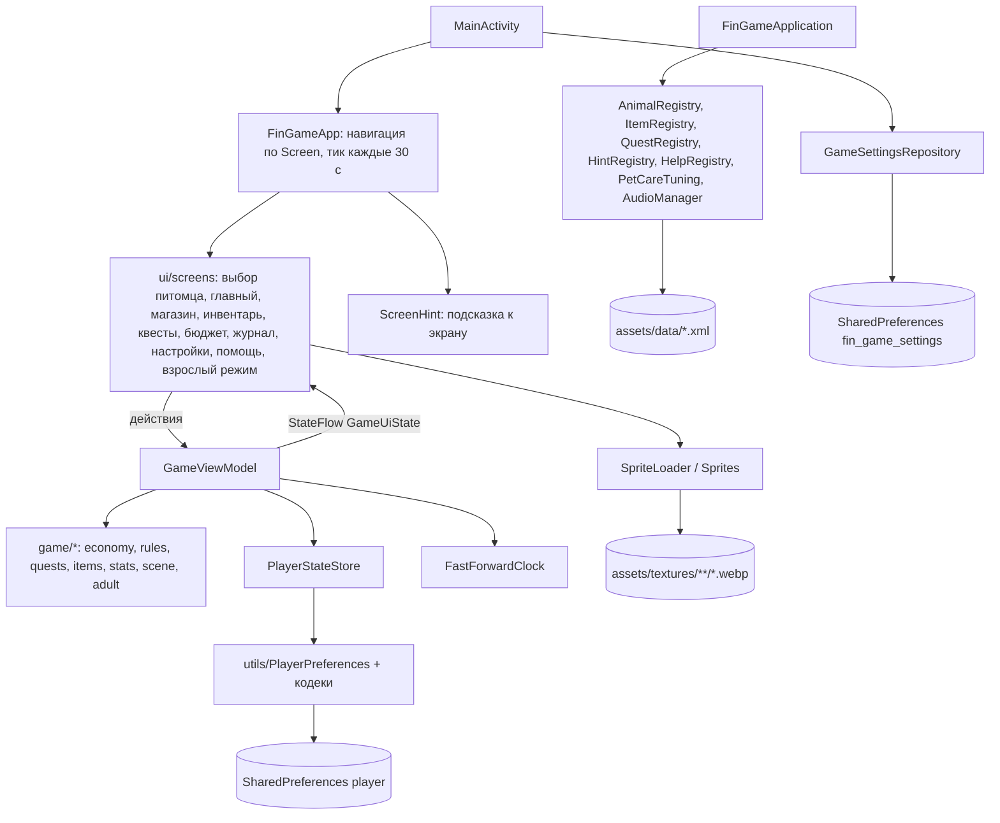

# Архитектура и структура данных

Как устроено приложение: слои и компоненты, экраны и переходы, жизненный цикл данных,
сохраняемый профиль и каталоги XML.

Пути к исходникам даны относительно `app/src/main/java/com/legacy/fingame/`, пути к данным —
относительно `app/src/main/assets/`.

Связанные разделы: [сборка](build.md), [предметы](items.md), [животные](animals.md),
[рост питомца](pet-growth.md), [квесты](quests.md), [сцена](scene.md), [экономика](economy.md).

## 1. Общая схема

Серверной части нет. Приложение — один модуль `:app`, одна Activity, весь интерфейс на Jetpack
Compose. Однонаправленный поток данных с одной `ViewModel`:

- экраны получают неизменяемое состояние `GameUiState` из `StateFlow` и отправляют действия в
  `GameViewModel`;
- `GameViewModel` применяет правила из чистых Kotlin-объектов слоя `game/*` (без зависимостей от
  Android: экономика, рост, квесты, сцена) и сохраняет результат через интерфейс `PlayerStateStore`;
- реализация хранилища — `utils/PlayerPreferences` поверх `SharedPreferences`;
- неизменяемые игровые данные (животные, предметы, квесты, подсказки, словарик, правила ухода,
  аудио) читаются из XML в `assets/data/` один раз при старте.

Схема ниже — в формате Mermaid, GitHub показывает её картинкой. Стрелки — кто кого вызывает или
откуда берёт данные; подробнее о каждом блоке — в таблице раздела 2.

## 2. Компоненты

| Слой / пакет | Компоненты | Ответственность |
|---|---|---|
| точка входа | `MainActivity` | Edge-to-edge, загрузка настроек, запуск звука, создание `GameViewModel` (с `ignoreQuestDelays = false` — квесты во всех сборках ждут по правилам), тема, раздача `LocalAnimationsEnabled` |
| точка входа | `FinGameApplication` | Реестры данных, `PlayerPreferences`, `PetCareTuning` из `care.xml`, общий на процесс `AudioManager` (музыка не прерывается при повороте) |
| точка входа | `DemoMode` | Флаг демо-сборки `BuildConfig.DEMO_MODE`, шаг перемотки 12 ч |
| `game` | `GameViewModel`, `GameUiState`, `Screen` | Состояние игры и все действия игрока и взрослого |
| `game` | `PlayerState`, `PlayerStateStore` | Сохраняемый профиль и интерфейс хранилища |
| `game/economy` | `Economy`, `Budget*`, `SpendKind`, `BudgetHistory`, `Deposit`, `MoneyLog`, `GameClock`, `FastForwardClock`, `goalProgress` | Деньги, план периода, вклад, журнал, время → [economy.md](economy.md) |
| `game/rules` | `PetCareRules`, `PetCareTuning`, `PetCare`, `CarePricedCatalog`, `PetCareTuningReader` | Рост от ухода и мягкие штрафы → [pet-growth.md](pet-growth.md) |
| `game/stats` | `PetStats`, `StatKind` | Шкалы питомца и их убывание |
| `game/animals` | `Animal`, `AnimalReader`, `AnimalRegistry`, `AnimalSelection`, `Growth` | Виды питомцев, этапы → [animals.md](animals.md) |
| `game/items` | `Item`, `ItemCategory`, `ItemUse`, `ItemSelection`, `ItemSprites`, `ItemReader`, `ItemRegistry`, `ItemCatalog`, `Cart`, `Inventory`, `Goals`, `ShopShelf`, `CustomItems` | Каталог, магазин, инвентарь, цели, свои предметы → [items.md](items.md) |
| `game/quests` | `Quest*`, `QuestEngine`, `QuestReader`, `QuestRegistry`, `QuestBoard`, `QuestLog`, `QuestTopic`, `CustomQuests` | Квесты → [quests.md](quests.md) |
| `game/scene` | `GameLayer`, `GameScene`, `SceneViewport`, `PetTouch` | Слои, геометрия, поглаживание → [scene.md](scene.md) |
| `game/adult` | `ParentLock`, `AdultReports`, `AdultProgress`, `AdultMoney`, `RewardUsage` | Замок, отчёты, прогресс по темам, изменение монет, награды |
| `game/hints` | `Hint`, `HintKeys`, `HintReader`, `HintRegistry` | Подсказки по экранам → [education.md](education.md) |
| `game/help` | `HelpEntry`, `HelpReader`, `HelpRegistry` | Словарик для экрана «Помощь» |
| `game/settings` | `GameSettings`, `GameSettingsRepository`, `AudioManager`, `AudioReader`, `ThemeMode` | Громкость звуков и музыки, анимации, тема, воспроизведение |
| `ui` | `FinGameApp`, `ClickSound`, `DemoContent` | Корневой Composable: навигация, «Назад», тик, показ подсказки; щелчок кнопок |
| `ui/screens` | `MainScreen`, `AnimalSelectScreen`, `ShopScreen`, `InventoryScreen`, `QuestsScreen`, `BudgetScreen`, `LogScreen`, `SettingsScreen`, `HelpScreen`, `AdultLockScreen`, `AdultScreen` и вкладки `Adult*Tab`, `GoalsCarousel`, `PlaceholderScreen` | Экраны |
| `ui/screens` | `MoneyFormat`, `GoalFormat`, `QuestFormat`, `AdultFormat`, `AmountSteps`, `ShopCardSizing` | Тексты, форматирование сумм и дат, шаги ввода, размеры карточек |
| `ui/components` | `GameComponents`, `GameDialog`, `ScreenHint`, `Sprites`, `PillButtonSizing` | Общие кнопки, шкалы, диалоги, окно подсказки, пути к спрайтам интерфейса |
| `ui/theme` | `Theme`, `Color`, `Type`, `Fonts`, `Dimens`, `Motion` | Цвета, пиксельная типографика, размеры для телефона и планшета, выключение анимаций (`LocalAnimationsEnabled`, окна без всплывания) |
| `utils` | `PlayerPreferences`, `*Codec`, `SpriteLoader` | Сохранение профиля, сериализация списков, загрузка спрайтов |

## 3. Экраны и переходы

Навигация — одно поле `GameUiState.screen` (`enum Screen`), переключение с плавным появлением
(`AnimatedContent` в `FinGameApp`; при выключенных анимациях — без перехода). Системная «Назад» с любого экрана, кроме главного, закрывает
экран (`closeScreen`: из взрослого режима и замка — в настройки, иначе — на главный).

| Экран | Как попасть | Что делает |
|---|---|---|
| Выбор питомца (`AnimalSelectScreen`) | Питомец не выбран: первый запуск, после сброса прогресса или если вида больше нет в данных | Вид и окрас, затем имя |
| `MAIN` | После выбора; «Назад» | Сцена с питомцем (поглаживание, жесты), шкалы, баланс, «Бонус дня +N», подсказка об уходе, карусель целей, кнопки разделов (точка на кнопке квестов), в демо-сборке «+12 ч» |
| `SHOP` | Кнопка магазина; нажатие на цель | Разделы, карточки, варианты, корзина, предупреждения, звёздочка цели → [items.md](items.md) |
| `INVENTORY` | Кнопка инвентаря | Съесть / поиграть / надеть / поставить / использовать |
| `QUESTS` | Кнопка квестов | Доска квестов → [quests.md](quests.md) |
| `BUDGET` | Сам после бонуса дня; кнопка бюджета; из журнала | «Новый день», итог прошлого периода, раскладка, вклад → [economy.md](economy.md) |
| `LOG` | Кнопка журнала; из бюджета | Движения денег по дням |
| `OPTIONS` | Кнопка настроек | Ползунки «Звуки» и «Музыка», переключатель «Анимации», тема «Светлая / Тёмная / Авто», «Режим взрослого», «Помощь», «Сбросить прогресс» (с подтверждением) |
| `HELP` | Настройки → «Помощь» | Словарик из 11 терминов и раздел «Подсказки по экранам» с кнопкой «Показать подсказки заново» |
| `ADULT_LOCK` | Настройки → «Режим взрослого» | Три примера на умножение (множители 3–9) |
| `ADULT_MODE` | После верных ответов | Вкладки «Прогресс», «Дни», «Покупки», «Квесты», «Цели», «Вещи», «Награды», «Журнал», «Товары» |

Поверх экрана один раз показывается подсказка к нему (`ScreenHint`, см.
[education.md](education.md)).

Пока открыт взрослый режим (`GameUiState.adultMode`), модель не выполняет действия ребёнка: покупки,
предметы, квесты, бонус, бюджет, цели (`GameViewModel.readOnly`). Взрослый режим не сохраняется —
после перезапуска игра снова у ребёнка.

## 4. Жизненный цикл данных

1. **Старт процесса.** `FinGameApplication.onCreate` читает все XML в реестры и создаёт
   `PlayerPreferences` и `AudioManager`.
2. **Создание `GameViewModel`** (`restoredState`): загружается `PlayerState`; часы игры
   восстанавливают сдвиг перемотки и не уходят назад от последнего показанного момента; шкалы
   убывают за прошедшее время; закрываются прошедшие дни питомца (рост, серия дней без заботы);
   отбрасываются квесты, которых нет в данных; своё надетое и цели проверяются по каталогу; гасится
   созревший вклад.
3. **Тик.** Пока приложение открыто и питомец выбран (на любом экране), `FinGameApp` раз в
   30 секунд вызывает `vm.tick()`: гасится
   созревший вклад, шкалы убывают, закрываются прошедшие дни питомца, пересчитывается этап, может
   выпасть случайный квест, пересчитывается точка на кнопке квестов. Если ничего не изменилось,
   состояние не пишется.
4. **Действия.** Каждое действие создаёт новое неизменяемое состояние и сразу сохраняет его
   (`persist()`), поэтому закрытие приложения в любой момент не теряет прогресс.
5. **Настройки** (громкость, анимации, тема) сохраняются отдельно при каждом изменении (`MainActivity` →
   `GameSettingsRepository.save`).

Время игры — `FastForwardClock` поверх часов устройства: хранит сдвиг перемотки демо-сборки и не
даёт времени уйти назад при переводе часов (см. [pet-growth.md](pet-growth.md), раздел 6).

## 5. Профиль игрока — `PlayerState`

Файл `game/PlayerState.kt`, один профиль на установку.

| Поле | Тип | По умолчанию | Смысл |
|---|---|---|---|
| `selection` | `AnimalSelection?` | `null` | Выбранный питомец; `null` — экран выбора |
| `petName` | `String` | `""` | Имя питомца |
| `subLocationIndex` | `Int` | 0 | Номер комнаты (в игре одна, см. [scene.md](scene.md)) |
| `balance` | `Int` | `Economy.STARTING_BALANCE` | Текущий счёт |
| `deposit` | `Deposit?` | `null` | Открытый вклад |
| `budget` | `BudgetState?` | `null` | План и факт текущего периода |
| `previousBudgetResult` | `BudgetResult?` | `null` | Итог прошлого периода |
| `budgetHistory` | `List<BudgetResult>` | пусто | Итоги прошлых периодов, до 60 |
| `budgetDraft` | `BudgetDraft?` | `null` | Незавершённая раскладка |
| `planningOpen` | `Boolean` | `false` | Открыто ли планирование нового периода |
| `moneyLog` | `MoneyLog` | пусто | Журнал денег, до 500 записей |
| `lastDailyBonusDay` | `Long` | `Long.MIN_VALUE` | День последнего бонуса (дни с 1970-01-01) |
| `owned` | `Map<ItemSelection, Int>` | пусто | Купленные предметы по варианту и количеству |
| `worn` | `Set<ItemSelection>` | пусто | Надетая одежда и поставленный декор |
| `goals` | `List<ItemSelection>` | пусто | Цели в порядке добавления |
| `stats` | `PetStats` | все 100 | Шкалы питомца |
| `statsUpdatedAtMillis` | `Long` | не задано | Момент последнего пересчёта шкал |
| `petBornAtMillis` | `Long` | не задано | Когда взяли питомца (начало его дней) |
| `care` | `PetCare?` | `null` | Рост, число закрытых дней, лучший индекс ухода за день, серия дней без заботы |
| `gameNowMillis` | `Long` | не задано | Последний показанный момент времени игры |
| `clockShiftMillis` | `Long` | 0 | Сдвиг времени от перемотки |
| `quests` | `List<QuestProgress>` | пусто | Прохождение квестов |
| `questsSeenAtMillis` | `Long` | не задано | Когда игрок последний раз смотрел квесты |
| `lastRandomQuestAtMillis` | `Long` | не задано | Когда выпал последний случайный квест |
| `questLog` | `QuestLog` | пусто | История выборов в квестах с отметками проверки, до 200 |
| `customItems`, `customQuests` | `List<Item>`, `List<Quest>` | пусто | Свои предметы и квесты взрослого |
| `rewardUsageLog` | `RewardUsageLog` | пусто | Использованные награды «Другое», до 100 |
| `rewardUsageSeenAtMillis` | `Long` | не задано | Когда взрослый смотрел «Награды» (счётчик новых) |
| `goalsReached` | `Int` | 0 | Сколько целей куплено |
| `hintsSeen` | `Set<String>` | пусто | Ключи закрытых подсказок к экранам |

Не сохраняются: текущий экран (всегда начинается с главного), корзина, режим взрослого.

## 6. Хранилище

**`PlayerPreferences`** (`utils/PlayerPreferences.kt`) — `SharedPreferences` с именем `player`,
`MODE_PRIVATE`.

- Простые поля — отдельные ключи: `selected_animal_id`, `selected_animal_variant_id`, `pet_name`,
  `sub_location_index`, `balance`, `last_daily_bonus_day`, `stats_updated_at`, `pet_born_at`,
  `game_now`, `clock_shift`, `planning_open`, `goals_reached` и т. д.
- Шкалы — по ключу на шкалу: `stat_health`, `stat_hunger`, `stat_pleasure`.
- Вклад — `deposit_amount`, `deposit_term_days`, `deposit_rate_percent`, `deposit_opened_day`.
- Бюджет, итог прошлого периода и черновик — группы `budget_*`, `previous_budget_*`,
  `budget_draft_*` с флагом присутствия `*_present`.
- Рост — `care_growth_millis`, `care_judged_days`, `care_day_best`, `care_neglect_streak`.
- Предметы — множества строк `owned_items` (`itemId:variantId=count`) и `worn_items`
  (`itemId:variantId`); подсказки — множество `hints_seen`.
- Списки — строками через кодеки: `money_log` (`MoneyLogCodec`), `goals` (`GoalsCodec`), `quests`
  (`QuestStateCodec`), `quest_log` (`QuestLogCodec`), `budget_history` (`BudgetHistoryCodec`),
  `reward_usage_log` (`RewardUsageLogCodec`), `custom_items` (`CustomItemsCodec`), `custom_quests`
  (`CustomQuestsCodec`, формат v2 с меткой `\u0002v2`); плюс `quests_seen_at`,
  `last_random_quest_at`, `reward_usage_seen_at`. Записи разделены символом U+001E, поля — U+001F,
  поэтому любые тексты сохраняются без экранирования; повреждённая запись пропускается с сообщением
  в logcat, остальные читаются.
- Совместимость: прежние форматы записей квеста (12 и 13 полей) и своих квестов (v1) читаются.
  Ключи прежних версий перечислены в `RETIRED_KEYS` (старый счёт `savings`, старая форма бюджета,
  флаг прежнего приветственного окна `onboarding_seen`) и удаляются при сохранении; деньги со
  старого счёта `savings` при загрузке возвращаются на баланс. `PlayerPreferencesKeysTest` следит,
  чтобы действующие и выведенные ключи не пересекались.

**Настройки** — `GameSettingsRepository`, `SharedPreferences` `fin_game_settings`: `sound_volume`,
`music_volume` (0–100), `animations_enabled` (по умолчанию `true`), `theme_mode` (`LIGHT`, `DARK`, `AUTO`), а также `sound_enabled` и
`music_enabled` для совместимости со старыми сохранениями (если громкости нет, берётся 100 или 0 по
флагу). Сброс прогресса настройки не трогает.

## 7. Каталоги в `assets/data`

| Файл | Кто читает | Что внутри | Описание |
|---|---|---|---|
| `animals.xml` | `AnimalReader` → `AnimalRegistry` | Виды, окрасы, число этапов | [animals.md](animals.md) |
| `items.xml` | `ItemReader` → `ItemRegistry` | Предметы, варианты, эффекты, слой | [items.md](items.md) |
| `quests.xml` | `QuestReader` → `QuestRegistry` | Квесты, шаги, варианты | [quests.md](quests.md) |
| `care.xml` | `PetCareTuningReader` | Пороги роста и штрафы | [pet-growth.md](pet-growth.md) |
| `hints.xml` | `HintReader` → `HintRegistry` | Подсказки по экранам | [education.md](education.md) |
| `help.xml` | `HelpReader` → `HelpRegistry` | Словарик терминов | [education.md](education.md) |
| `audio.xml` | `AudioReader` → `AudioManager` | Список фоновых треков относительно `assets/audio/` | [ux-accessibility.md](ux-accessibility.md) |

Читатели пропускают некорректные записи с сообщением в logcat и не роняют игру.

## 8. Данные взрослого режима

| Структура | Файл | Содержимое |
|---|---|---|
| `LockTask`, `lockTasksOf`, `isSolved` | `game/adult/ParentLock.kt` | Три разных примера `a × b`, множители 3–9 |
| `DayReport` | `game/adult/AdultReports.kt` | По игровому дню: план, факт трат по видам, доход, покупки |
| `QuestHistoryEntry` | `game/adult/AdultReports.kt` | Квест и все выборы ребёнка в нём с отметками проверки |
| `ProgressReport`, `TopicProgress`, `TopicFact` | `game/adult/AdultProgress.kt` | Прогресс по шести темам без оценок → [education.md](education.md) |
| `AdultMoney` | `game/adult/AdultMoney.kt` | Проверка ручного изменения монет → [economy.md](economy.md) |
| `RewardUsage`, `RewardUsageLog` | `game/adult/RewardUsage.kt` | Использованные награды «Другое» |
| `CustomItems`, `CustomQuests` | `game/items/CustomItems.kt`, `game/quests/CustomQuests.kt` | Свои предметы и квесты → [items.md](items.md), [quests.md](quests.md) |
